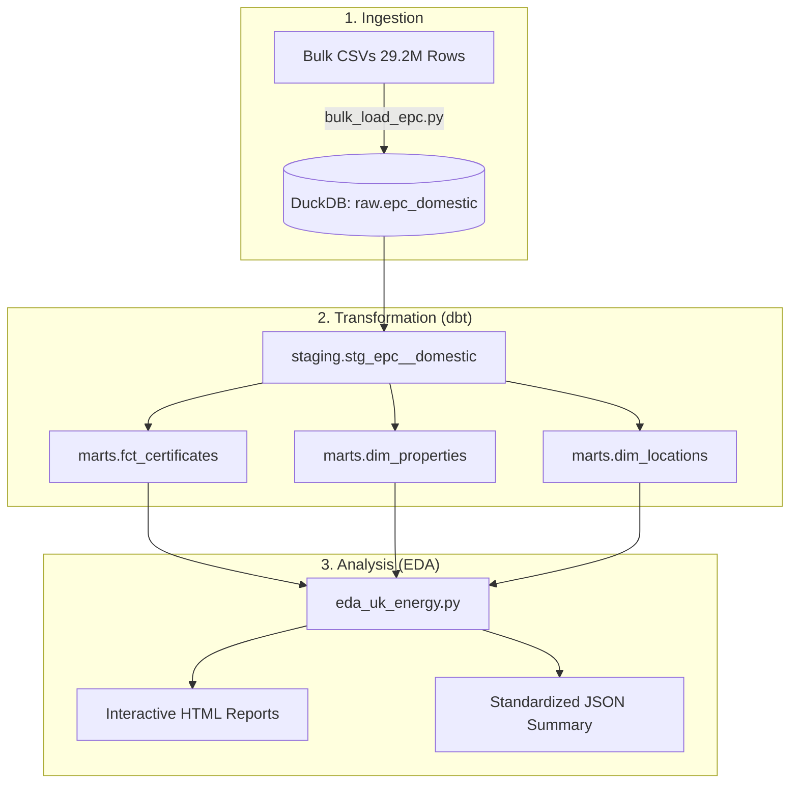

# UK Energy Data Pipeline (EPC)

🚀 **Analyzing 29.2 Million Energy Performance Certificates at Scale.**

This project implements an industry-standard **Medallion Architecture** to ingest, transform, and analyze the complete UK Domestic Energy Performance Certificate (EPC) dataset. Using **DuckDB** for lightning-fast processing and **dbt** for modular transformations, we move 30M records from raw CSVs to actionable insights in seconds.

---

## 🧭 Purpose
The UK Energy Performance Certificate (EPC) dataset is a massive repository of every energy assessment conducted in the country. 
- **The Research Objective**: To identify the national distribution of energy efficiency, measure the "Potential vs. Current" efficiency gap, and quantify the total carbon reduction potential available through home improvements.
- **The Scale**: ~29.2 million records $(\approx 50GB$ raw data $)$.

---

## 🏗️ Architecture

We follow a **Medallion Architecture** (Raw → Staging → Marts) using **DuckDB** as the unified storage and compute engine.



---

## 🛠️ Tech Stack
-   **Database**: [DuckDB](https://duckdb.org/) (In-process OLAP).
-   **Transformation**: [dbt-duckdb](https://github.com/jwills/dbt-duckdb) (Data Build Tool).
-   **Execution**: [Polars](https://pola.rs/) (High-performance DataFrame library).
-   **Visualization**: [Plotly](https://plotly.com/) & [Seaborn](https://seaborn.pydata.org/).
-   **Language**: Python 3.12+.

---

## ⚙️ Installation & Setup

### 1. Prerequisites
- **Git** (Version control).
- **Python 3.12+**.
- **Homebrew** (Optional, for Mac installation).

### 2. Environment Setup
```bash
# Clone the repository
git clone <your-repo-url>
cd dbt_learn

# Create a virtual environment
python3 -m venv dbt-env
source dbt-env/bin/activate

# Install dependencies
pip install -r requirements.txt
```

### 3. Data Ingestion
1. Place your bulk EPC data in the folder `./all-domestic-certificates/`.
2. Run the bulk loader:
```bash
python bulk_load_epc.py
```
*This will create `ducklake_energy_uk/dev.duckdb` and load 29.2M rows (~10s).*

### 4. dbt Transformations
```bash
cd ducklake_energy_uk
dbt deps        # Install dbt-utils
dbt run         # Build Staging, Marts, and Analytical Views
```

### 5. Running the EDA Suite
```bash
cd ..
python eda_uk_energy.py
```
*Interactive charts and summaries will be generated in the `reports/` folder.*

---

## 📖 Component Reference

### `bulk_load_epc.py`
Uses DuckDB's native `read_csv_auto` with globbing to ingest thousands of CSV files in a single command. It types everything as `VARCHAR` first to ensure 100% ingestion success.

### `ducklake_energy_uk/` (dbt Project)
- **Staging**: Cleans, renames, and types the raw data.
- **Normalized Marts**: Splits the flat data into `dim_properties` (latest known state), `dim_locations` (unique postcodes), and `fct_certificates` (fact table).
- **Analytics Views**: Specialized summaries for regional leaderboards and construction era trends.

### `eda_uk_energy.py`
Leverages the **Arrow Bridge** between DuckDB and Polars for zero-copy memory transfer. Generates interactive Plotly visualizations for national energy distributions.

---

## 🏁 Future Roadmap (The Next Steps)

- **[ ] Standardize Construction Age Bands**: Map fragmented strings into consistent decades.
- **[ ] Normalize Fuel Types**: Consolidate fuel naming (e.g., Gas, Main Gas).
- **[ ] Add dbt Tests**: 
    - `not-null` on UPRN and Certificate ID.
    - `accepted-values` (A-G) on EPC bands.
- **[ ] Documentation**: Run `dbt docs generate` for full lineage visualization.
- **[ ] CI/CD**: Push to GitHub and set up Actions for data validation.

---

## 🛡️ License
MIT License.
