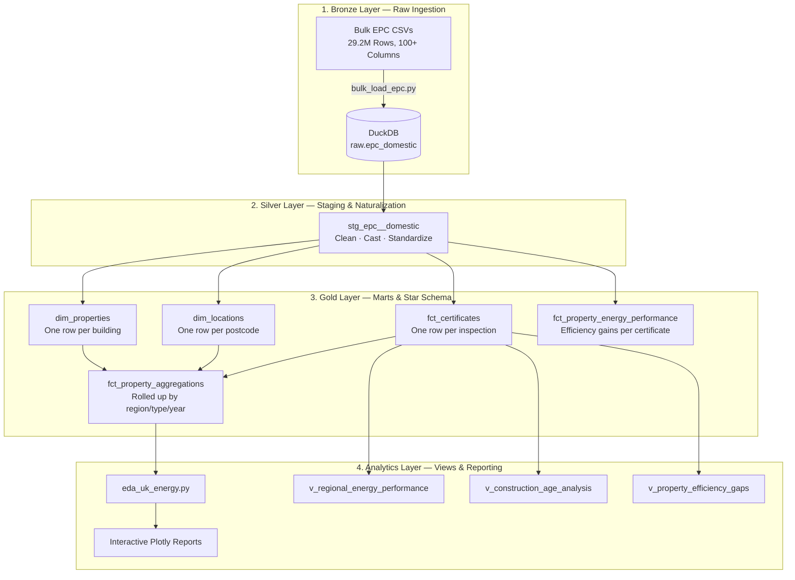

# UK Energy Data Masterclass (EPC)

**A Modern Analytics Journey: From 29.2 Million Flat Records to a Normalized Star Schema.**

This repository is both a working data pipeline and a learning resource. It demonstrates how to handle a massive real-world dataset (~50GB, 29.2M rows) using a local, high-performance stack — **DuckDB**, **dbt**, and **Polars** — on a single laptop in under 60 seconds.

**[Live Dashboard →](https://shazankk.github.io/UK-Energy-Data-EPC/)** — 12-section interactive EPC analytics: rating distributions, county efficiency, retrofit priority matrix, geographic choropleth map, fuel type impact, annual EPC trend, energy cost breakdown, and more.

---

## What is EPC Data?

An **Energy Performance Certificate (EPC)** is a legal document required in the UK whenever a property is built, sold, or rented. Every certificate records how energy-efficient a building is on a scale of **A (most efficient) to G (least efficient)**, along with details like CO2 emissions, heating costs, property age, and construction type.

The UK Government publishes all EPC records as open data. The full domestic dataset contains **29.2 million certificates**, representing decades of inspections across England and Wales. This makes it one of the richest freely available datasets for understanding the UK's built environment and its path to Net Zero carbon emissions.

**Why does it matter?**
- Buildings account for ~20% of the UK's total CO2 emissions.
- The government's Net Zero target requires most homes to reach EPC Band C by 2035.
- This dataset lets us model *where* the worst-performing properties are, *how much* improvement is possible, and *which property types* need the most intervention.

---

## The Core Challenge

The raw data is delivered as hundreds of CSV files — a single flat table with 100+ columns, containing duplicate entries because the same property gets re-inspected every time it is sold. Analyzing this at scale requires:

1. **Speed**: 29.2M rows cannot be loaded into a standard spreadsheet or even basic Python scripts without running out of memory.
2. **Deduplication**: The same building may have 10+ certificates. We need the *latest* state of each property.
3. **Consistency**: The raw data contains 30+ inconsistent values for "fuel type" and "construction age" that must be standardized before any analysis is meaningful.
4. **Structure**: A flat 100-column table is slow to query and hard to maintain. It needs to be broken into a proper relational model.

---

## The Solution: Medallion Architecture

We process the data through three distinct logical layers, each building on the previous:



| Layer | Also Called | Purpose |
|---|---|---|
| Bronze | Raw | Data exactly as it arrived — no transformations |
| Silver | Staging | Cleaned, typed, and standardized — trustworthy data |
| Gold | Marts | Business-structured — optimized for queries and analysis |
| Analytics | Views | Pre-joined, ready-to-use reporting layers |

---

## Technology Stack

### Why not just use Excel or Pandas?

29.2 million rows at ~50GB simply does not fit in memory using traditional tools. Pandas would throw a `MemoryError`. Excel supports 1 million rows. We need purpose-built OLAP (Online Analytical Processing) tools.

---

### DuckDB — The Storage & SQL Engine

**What it is**: An in-process analytical database. Think "SQLite for analytics."

**Why it matters**: Traditional databases like Postgres or MySQL are built for *transactional* workloads (fast single-row reads/writes). DuckDB is built for *analytical* workloads (aggregating millions of rows at once). It achieves this through:

- **Columnar storage**: Instead of storing a full row at a time (like a CSV), DuckDB stores each column separately on disk. When you run `SELECT AVG(co2_emissions)`, it only reads the one CO2 column — not all 100 columns for 29M rows.
- **Vectorized execution**: SQL operations are applied to batches of thousands of values at once using CPU SIMD instructions, rather than row-by-row. This is the same principle that makes GPUs fast for graphics.
- **Zero external dependencies**: Runs entirely inside the Python process. No server to start, no connection strings, no credentials.

**Result**: Sub-second aggregations on 29.2 million rows, directly on a laptop.

---

### dbt — The Transformation Orchestrator

**What it is**: dbt (Data Build Tool) manages the SQL transformation layer. It lets you write modular, version-controlled SQL and handles dependency ordering, testing, and documentation automatically.

**Why it matters**: Without dbt, a pipeline with 10+ SQL models is a folder of scripts you run in some specific order you have to remember. With dbt:
- Models know their dependencies via `{{ ref('model_name') }}` — dbt builds a DAG and runs them in the right order automatically.
- Every model is testable with one command (`dbt test`).
- The full lineage graph (what feeds what) is generated automatically as documentation.

---

### Polars — The Processing Engine

**What it is**: A DataFrame library for Python, written in Rust. Think "Pandas, but 10-100x faster."

**Why it matters**: While DuckDB excels at SQL aggregations, complex Python-side transformations and visualisation preparation are better done in a DataFrame. Polars uses:
- **Lazy evaluation**: You can chain operations and Polars builds an optimized execution plan before touching a single row.
- **Multi-threading**: Operations automatically use all CPU cores.
- **Memory efficiency**: Rust's memory model means no garbage collection pauses and minimal copying.

---

### Apache Arrow — The Zero-Copy Bridge

**What it is**: A standardized in-memory columnar data format. Not a tool you interact with directly — it's the shared "language" between DuckDB and Polars.

**Why it matters**: Normally, moving data from a database to a DataFrame involves serializing to bytes (slow), transferring, then deserializing (slow again). Because both DuckDB and Polars speak Apache Arrow natively, data stays in the same memory location — there is **zero copying**. The transfer of 29M rows from DuckDB to Polars is effectively instantaneous.

```python
# This single line hands millions of rows to Polars with zero overhead
df = conn.query("SELECT * FROM fct_certificates").pl()
```

---

### Plotly — The Visual Layer

**Plotly** powers all interactive visualisations in the single-file dashboard (`reports/dashboard.html`). Every chart embeds as a `<div>` snippet with Plotly.js loaded once from CDN — the result is a self-contained HTML file that works in any browser with no server.

Charts are deliberately chosen to avoid overplotting on 29M-row datasets:
- **Box plots** for CO₂ distributions (median + IQR, no scatter ink-blot)
- **2D density contours** for efficiency vs CO₂ (mass of data as "hills")
- **Heatmaps** for retrofit priority matrix and postcode EPC bands
- **`go.Scattergeo` filled polygons** for the geographic map (bypasses GeoJSON matching, works offline)

---

## Key Engineering Concepts

### 1. Normalization: From Flat to Star Schema

The raw data is one flat table with 100+ columns. Every time a property is inspected, *all* of its address and physical characteristics are repeated — even if nothing changed. This is wasteful and slow.

**Normalization** splits this into purpose-specific tables:

| Table | Grain (one row = ?) | Contains |
|---|---|---|
| `dim_properties` | One building (UPRN) | Property type, age band, floor area — the *latest* state |
| `dim_locations` | One postcode | County, town, local authority, constituency |
| `fct_certificates` | One inspection event | Energy ratings, CO2 figures, costs, dates |
| `fct_property_energy_performance` | One inspection event | Efficiency gain potential, total annual cost |
| `fct_property_aggregations` | One group (county × type × tenure × year) | Pre-aggregated counts, averages for BI dashboards |

**The "Latest Property" Pattern**: To build `dim_properties` we must isolate the most recent inspection per building. We use a SQL Window Function:

```sql
-- Get the most recent state of each building
with ranked as (
    select
        uprn, property_type, construction_age_band, -- ...
        row_number() over (
            partition by uprn                       -- "for each building..."
            order by inspection_at desc             -- "...rank by newest first"
        ) as rn
    from stg_epc__domestic
)
select * from ranked where rn = 1  -- Keep only the most recent
```

A **Window Function** (`ROW_NUMBER() OVER (...)`) assigns a rank to each row *within a group* without collapsing the rows. It's one of the most powerful features in SQL for analytics.

---

### 2. Surrogate Keys vs Natural Keys

A **natural key** is an ID that exists in the real world: a postcode, a UPRN, a passport number. The problem with using natural keys directly as table join keys is that they can change, they can be null, or they may not exist at all in some systems.

A **surrogate key** is a system-generated ID we create ourselves. We use MD5 hashing via `dbt_utils.generate_surrogate_key`:

```sql
-- Creates a deterministic, consistent ID from any input value
{{ dbt_utils.generate_surrogate_key(['postcode']) }} as location_id

-- The same postcode ALWAYS produces the same location_id
-- 'SW1A 1AA' → always hashes to the same 32-character hex string
```

**Why this matters**: Even if you reload all 29.2M rows from scratch, every `location_id` will be identical. You can safely join across load batches without managing auto-incrementing integers or worrying about order of insertion.

---

### 3. Materialization Strategies

**Materialization** controls how dbt physically stores a model's result in the database.

| Strategy | What it does | When to use |
|---|---|---|
| `view` | Stores the SQL query definition only. Result is computed every time you query it. | Analytical summaries that are cheap to recompute (`v_regional_energy_performance`) |
| `table` | Runs the query once and stores the result as a physical table. | Large, expensive transformations — `dim_properties`, `fct_certificates` |
| `incremental` | Only processes new/changed rows since the last run. | Very large tables where a full refresh would take too long |
| `ephemeral` | The model is inlined as a CTE — never stored at all. | Intermediate logic shared across models |

In this project, all dimension and fact tables are `table` (computed once, fast to query). All analytics views are `view` (always fresh, flexible to change).

---

### 4. The DuckDB → Polars Arrow Bridge in Detail

```
DuckDB (SQL world)
    ↓ executes query, holds result as Arrow arrays in memory
Apache Arrow buffer (shared memory)
    ↑ Polars reads pointer to same memory — no copy made
Polars (Python world)
```

This pattern is used in `eda_uk_energy.py`:
```python
import duckdb, polars as pl

conn = duckdb.connect("ducklake_energy_uk/dev.duckdb")

# .pl() = "give me a Polars DataFrame via Arrow"
df = conn.query("SELECT * FROM fct_property_aggregations").pl()

# Now df is a full Polars DataFrame — billions of cells, zero serialization cost
```

---

## Project Structure

```
dbt_learn/
├── bulk_load_epc.py              # Step 1: Ingest CSVs → DuckDB
├── eda_uk_energy.py              # Step 3: DuckDB → Polars → Plotly reports
├── requirements.txt              # Python dependencies
├── DBT_WORKFLOW.md               # Deep dive: dbt concepts and this project's workflow
├── ducklake_energy_uk/           # The dbt project
│   ├── dbt_project.yml           # Project configuration
│   ├── packages.yml              # External packages (dbt_utils)
│   ├── models/
│   │   ├── staging/epc/          # Silver layer: stg_epc__domestic
│   │   └── marts/
│   │       ├── energy/           # Gold layer: dims, facts
│   │       └── analytics/        # Views: regional, age, efficiency gap
│   ├── macros/                   # Custom Jinja SQL macros
│   ├── seeds/                    # Static reference CSVs
│   └── tests/                    # Custom singular data tests
└── all-domestic-certificates/    # Raw EPC CSVs (~50GB, not in git)
```

---

## Installation & Setup

### Prerequisites

- Python 3.10+
- ~60GB free disk space (for raw CSVs)
- Download the EPC bulk data from: [https://epc.opendatacommunities.org/](https://epc.opendatacommunities.org/) and extract into `all-domestic-certificates/`

### 1. Create the Python Environment

```bash
git clone https://github.com/Shazankk/UK-Energy-Data-EPC.git
cd dbt_learn
python3 -m venv dbt-env
source dbt-env/bin/activate      # On Windows: dbt-env\Scripts\activate
pip install -r requirements.txt
```

### 2. Run the Full Pipeline

```bash
# Step 1 — Ingest: Load 29.2M rows from CSV into DuckDB
python bulk_load_epc.py

# Step 2 — Transform: Build the star schema via dbt
cd ducklake_energy_uk
dbt deps          # Install dbt_utils package
dbt run           # Execute all models in dependency order
dbt test          # Validate data quality (not_null, accepted_values, unique)

# Step 3 — Analyze: Generate interactive HTML reports
cd ..
python eda_uk_energy.py
```

### 3. Explore the Lineage Graph

```bash
cd ducklake_energy_uk
dbt docs generate   # Compile documentation
dbt docs serve      # Opens browser at localhost:8080 with visual DAG
```

---

## Dashboard Sections

The live dashboard (`reports/dashboard.html`) contains 12 analytical sections, all generated from the DuckDB star schema:

| # | Section | Chart Type | Key Insight |
|---|---|---|---|
| KPI | Headline figures | Cards | Total properties, avg SAP, CO₂ saving potential, % below Band C |
| 1 | National EPC Rating Distribution | Bar | 58%+ of properties rated D or below — miss the 2035 Band C target |
| 2 | County Efficiency: Best vs Worst 20 | Horizontal bar | Rural counties average SAP 52; urban counties SAP 72+ |
| 3 | Efficiency by Construction Decade | Grouped bar | Pre-1900 homes: SAP 53 today → SAP 75 potential (+22 pts) |
| 4 | CO₂ by Property Type | Box plots | Detached houses emit 5× more CO₂ than typical flats |
| 5 | Efficiency vs CO₂ Density | 2D contour | D/E band cluster at 60–70 SAP / 2–3 t CO₂ dominates |
| 6 | Retrofit Priority Matrix | Heatmap | Pre-1900 detached & semi-detached score highest priority |
| 7 | Local Authority Treemap | Treemap | County → LA: box size = CO₂ saving potential, colour = efficiency |
| 8 | Postcode Area Heatmap | Matrix heatmap | Rural areas (TR, PL, EX) skew E–G; urban (E, N, SW) skew C–D |
| 9 | Geographic EPC Map | Scattergeo polygons | Choropleth of all 362 UK LADs by avg SAP score |
| 10 | Fuel Type Impact | Grouped bar | Solid fuel: SAP 35 vs Mains Gas: SAP 66 — a 31-point structural gap |
| 11 | EPC Score Trend 2008–2024 | Dual-axis line | +7.2 SAP points in 16 yrs — 3× faster improvement needed for 2035 |
| 12 | Annual Energy Cost by Property Type | Stacked bar | Detached houses spend 2.6× more on heating than flats |

---

## Roadmap

- [x] **Phase 1**: 29.2M row ingestion and core star schema (dim/fct normalization)
- [x] **Phase 2**: Standardized construction age bands, fuel types, and automated dbt quality tests
- [x] **Phase 3**: Retrofit Priority Score model (`v_retrofit_priority`) — composite 0–100 score per property type × age band × local authority
- [x] **Dashboard**: 12-section single-file interactive analytics dashboard deployed via GitHub Pages
- [x] **Geographic Analysis**: LAD-level choropleth map, fuel type impact, annual EPC trend, cost breakdown
- [x] **Documentation**: Learning masterclass and dbt visual lineage
- [ ] **Phase 4**: Advanced energy prediction modeling and carbon-neutral scenario simulations
- [ ] **Deployment**: Full BI dashboard (Streamlit/Next.js) with live filtering

---

## Reference Documents

- **[DBT_WORKFLOW.md](./DBT_WORKFLOW.md)** — Deep dive into dbt concepts, the Medallion Architecture, normalization patterns, and step-by-step workflow explanation for engineers of all backgrounds.

---

## License

Distributed under the MIT License. See `LICENSE` for more information.
