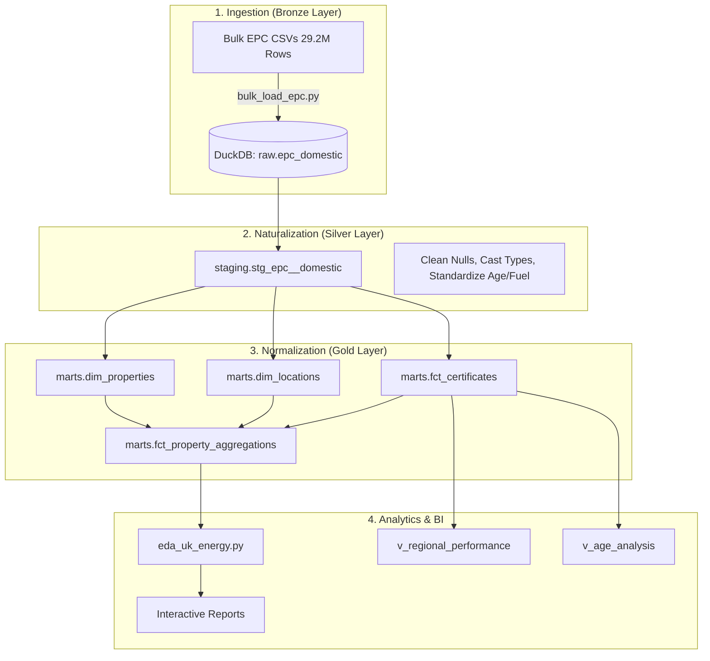

# UK Energy Data Masterclass (EPC)

🚀 **A Modern Analytics Journey: From 29.2 Million Flat Records to a Normalized Star Schema.**

This repository is more than a data pipeline—it’s a learning tool designed to demonstrate how to handle massive datasets (~50GB, 29.2M rows) using a local, high-performance stack: **DuckDB**, **dbt**, and **Polars**.

---

## 🧭 The Core Objective
The UK Energy Performance Certificate (EPC) dataset is the primary record of building efficiency in Britain. 
- **The Challenge**: How do you analyze 30 million records, deduplicate properties, and generate interactive reports on a single laptop in under 60 seconds?
- **The Answer**: A **Medallion Architecture** using modern in-process OLAP tools.

---

## 🏗️ Architecture & Learning Pathway

We move through three distinct logical layers to ensure data integrity and query performance.



---

## 📚 Reference & Deep Dives

For a detailed understanding of the engineering principles, industrial standards, and the step-by-step transformation lifecycle, refer to these masterclass documents:

- 🎓 **[dbt Masterclass (DBT_WORKFLOW.md)](file:///Users/shazank/Projects/Backend/dbt_learn/DBT_WORKFLOW.md)**: Deep dive into Medallion Architecture, normalization, and dbt core concepts.
- 📦 **[Raw Ingestion (bulk_load_epc.py)](file:///Users/shazank/Projects/Backend/dbt_learn/bulk_load_epc.py)**: The 30M row high-velocity loading script.
- 📊 **[EDA Suite (eda_uk_energy.py)](file:///Users/shazank/Projects/Backend/dbt_learn/eda_uk_energy.py)**: Interactive Plotly/Polars analysis.

---

## 🧱 Architecture Selection & Rationale

Why did we choose this specific stack? To build a **production-grade warehouse on a laptop**. Here is the breakdown of our "Modern Data Stack (Local Edition)":

### 🦆 DuckDB: The Storage & SQL Engine
*   **The Role**: In-process OLAP (Online Analytical Processing) database.
*   **The "Why"**: Traditional databases (Postgres/MySQL) struggle with 30M row aggregations on limited RAM. DuckDB uses **vectorized query execution** and a columnar storage format, allowing it to perform sub-second analytical queries on 29.2M rows directly from disk. It's essentially "SQLite for Analytics."

### 🐻 Polars: The Processing Engine
*   **The Role**: Lightning-fast DataFrame library (the successor to Pandas).
*   **The "Why"**: While DuckDB is great for SQL, Polars is superior for complex data manipulations and machine learning preparation. Written in **Rust**, Polars is multi-threaded by design and incredibly memory-efficient. It allows us to perform EDA on the entire dataset without ever hitting a "Memory Error."

### 🏹 Apache Arrow: The Universal Bridge
*   **The Role**: In-memory columnar data format.
*   **The "Why"**: This is the "secret sauce." Transitioning data from a database (DuckDB) to a DataFrame (Polars) usually involves slow serialization. Because both tools support **Apache Arrow**, data is passed via **zero-copy**. The data stays in the same place in memory, and both tools just look at it. This makes the "DuckDB -> Polars" transition instantaneous.

### 🛠️ dbt (Data Build Tool): The Orchestrator
*   **The Role**: Transformation management and Data Modeling.
*   **The "Why"**: dbt allows us to treat data like software. We get **version control**, **automated testing**, and **lineage tracking**. Without dbt, 100+ lines of SQL transformation would be a "black box"; with dbt, it's a modular, documented pipeline.

### 📈 Plotly & Seaborn: The Visual Layer
*   **The Role**: Static and Interactive data visualization.
*   **The "Why"**: Plotly provides the interactive "drill-down" capability (seeing specific UPRNs in a cluster), while Seaborn provides the statistical rigor for distribution plots and efficiency correlations.

---

## 🎓 Key Learning Moments

### 1. Why Normalization? (Flat to Star Schema)
Initially, the dataset is a single flat table with 100+ columns. Storing address details and property characteristics repeatedly for every 10 years of inspections is inefficient.

#### 🎓 Teaching Moment: The "Latest Property" Pattern
To create `dim_properties`, we must isolate the most recent state of a building. We use a **Window Function** to rank inspections per UPRN:

```sql
-- models/marts/energy/dim_properties.sql
with ranked_properties as (
    select
        uprn, property_type, built_form, -- ... other fields
        row_number() over (
            partition by uprn 
            order by inspection_at desc, lodgement_at desc
        ) as property_rank
    from stg_epc__domestic
)
select * from ranked_properties where property_rank = 1
```

- **`dim_locations`**: We deduplicate postcodes and counties to create a lightweight geographic registry.
- **`fct_certificates`**: A thin fact table containing only metrics (CO2, costs) and keys, allowing for sub-second joins.

### 2. The Power of "Surrogate Keys"
We use `dbt_utils.generate_surrogate_key` (MD5 hashing) to create deterministic primary keys.

```sql
-- Example: Creating a unique location ID from a postcode
{{ dbt_utils.generate_surrogate_key(['postcode']) }} as location_id
```

This allows us to link tables reliably without managing auto-incrementing integers across different load batches.

### 3. The "Arrow Bridge" (DuckDB <-> Polars)
One of the most powerful patterns in modern Python analytics:
- **DuckDB** handles the heavy SQL lifting and disk I/O.
- **Apache Arrow** acts as the cross-language memory format.
- **Polars** receives the data with **zero-copy overhead**, allowing it to process millions of rows in milliseconds using its multi-threaded execution engine.

---

## ⚙️ Technical Deep Dive

### I. Ingestion Logic (`bulk_load_epc.py`)
Handling 30M rows requires speed. We use DuckDB's `read_csv_auto` which parallelizes CSV sniffing and loading across all CPU cores.
> **Tip**: We load as `VARCHAR` first. Why? Because manual type-casting mid-load is the #1 cause of ingestion failure on messy real-world data. We "naturalize" types safely in the staging layer.

### II. The dbt Transformation Workflow
Our dbt project (`ducklake_energy_uk`) manages complexity:
- **Lineage**: Every table is connected via `ref()` functions.
- **Modularity**: Logic is broken into small, testable blocks.
- **Materialization**: Large tables are materialized as `table`, while analytical summaries are kept as `view` for flexibility.

### III. High-Performance EDA (`eda_uk_energy.py`)
Using **Lazy Polars**, we scan the database without loading it all into RAM.
```python
# The Secret Sauce
df = conn.query("SELECT * FROM fct_certificates").pl() # Returns a Polars DataFrame via Arrow
```

---

## 🏁 Installation & Learning Guide

### 1. Setup Your Lab
```bash
git clone https://github.com/Shazankk/UK-Energy-Data-EPC.git
cd dbt_learn
python3 -m venv dbt-env
source dbt-env/bin/activate
pip install -r requirements.txt
```

### 2. Execute the Pipeline
1.  **Ingest**: `python bulk_load_epc.py` (Watch 29.2M rows fly into DuckDB).
2.  **Transform**: `cd ducklake_energy_uk && dbt deps && dbt run` (Build the Star Schema).
3.  **Analyze**: `cd .. && python eda_uk_energy.py` (Generate interactive reports).

---

## 🗺️ Path to Zero (The Roadmap)

This project is part of a journey toward UK Net Zero.
- [x] **Phase 1**: 29.2M Ingestion & Core Star Schema (Normalization).
- [x] **Phase 2**: Standardized Construction Age Bands, Fuel Types, and Automated dbt Quality Tests (A-G constraints).
- [x] **Documentation**: Created the Learning Masterclass and dbt visual lineage.
- [ ] **Phase 3**: Advanced Energy Prediction Modeling and Carbon-Neutral Scenario Simulations.
- [ ] **Deployment**: Visual Analytics Dashboard (Streamlit/Next.js) for regional energy performance comparison.

---

## 🛡️ License
Distributed under the MIT License. See `LICENSE` for more information.
